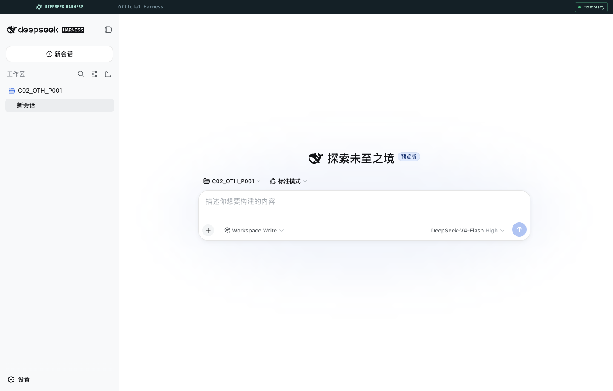

# DeepSeek Harness Desktop

English | [中文](README.md)

`DeepSeek Harness Desktop` is an Electron desktop shell for [DeepSeek Harness](https://github.com/deepseek-ai/deepseek-harness).



## Start Here

From [Releases](https://github.com/tamakiramimy/deepseek-harness-electron/releases), download two files from the **same version**. Each release has five assets: one Runtime Bundle and four Shell installers.

| Your device | Shell installer to download |
| --- | --- |
| Every device | `DeepSeek-Harness-Dist-<version>.zip` |
| macOS Apple Silicon | `DeepSeek.Harness.Desktop-<version>-darwin-arm64.dmg` |
| macOS Intel | `DeepSeek.Harness.Desktop-<version>-darwin-x64.dmg` |
| Windows ARM | `DeepSeek.Harness.Desktop-<version>-win32-arm64.exe` |
| Windows x64 | `DeepSeek.Harness.Desktop-<version>-win32-x64.exe` |

1. Download the Runtime Bundle and the one Shell installer for your device.
2. Install the Shell normally. Extract the Runtime Bundle and keep the extracted folder named `DeepSeek-Harness-Dist`.
3. Place that folder beside the installed application, then launch the app:

```text
Application directory/
|- DeepSeek Harness Desktop.app or DeepSeek Harness Desktop.exe
`- DeepSeek-Harness-Dist/
```

The Shell selects the matching Runtime automatically. No further setup is needed.

## Status

| Capability | Current behavior |
| --- | --- |
| Official DeepSeek Harness Web UI | Started by the Electron Utility Host and embedded in the main window |
| Electron shell | Starts safely, manages the local process, and reports runtime status |
| Chat and agent workflow | Use the official Harness page in the central window area |
| Runtime | Loaded from an independent, replaceable `DeepSeek-Harness-Dist/` Bundle; Shell installers do not embed official Harness |

## Prerequisites

- Node.js `>= 22.19.0`. The official Harness supports Node `^22.19.0 || >=24`.
- Corepack and pnpm. This shell uses pnpm `11.15.1`.
- Git.
- Optional: a DeepSeek API key. The UI can start without one, but model requests cannot run.

Check the environment:

```sh
node --version
corepack enable
pnpm --version
```

## Conventions

Unless noted otherwise, run commands from the repository root. From any subdirectory inside the Git checkout:

```sh
cd "$(git rev-parse --show-toplevel)"
```

## Initial Setup

### Install the Electron shell

```sh
cd "$(git rev-parse --show-toplevel)"
pnpm install
```

### Create the default Harness Runtime Dist

For local development, create a `DeepSeek-Harness-Dist/` directory for the current platform:

```sh
pnpm harness:dist:install
pnpm harness:dist:validate
```

The default setup installs the current npm-registry version of official `@deepseek-ai/dsh`. This direct directory serves the current machine architecture and is intended for local development:

```text
DeepSeek-Harness-Dist/
  runtime-manifest.json
  package.json
  package-lock.json
  node_modules/
    @deepseek-ai/dsh/lib/bin.js
    @deepseek-ai/dsh-web-frontend/dist/
    ...official Host, plugins, and native modules...
```

This directory is ignored by Git and is not committed with the Electron shell.

Do not commit API keys or signing credentials.

## Run the Desktop App

```sh
cd "$(git rev-parse --show-toplevel)"
pnpm dev
```

This command:

1. Starts the Electron and Vite development processes.
2. Creates an isolated Utility Host.
3. Uses Electron's Node runtime to launch official `dsh web`.
4. Waits for an HTTP readiness response from Harness.
5. Embeds the official Harness Web UI in the desktop window.

Harness uses the application's `userData/harness` directory as `DSH_HOME`. It binds only to a random `127.0.0.1` port and is never exposed to the LAN. The compact status bar shows the active loopback URL.

## Advanced: Update or Replace the Harness Runtime

Electron requires a `runtime-manifest.json` at the Runtime Dist root. Its `entry` must point to an official CLI file relative to that root. The default manifest is:

```json
{
  "format": 1,
  "entry": "node_modules/@deepseek-ai/dsh/lib/bin.js"
}
```

### Use another npm version

Edit `DeepSeek-Harness-Dist/package.json`, then reinstall the runtime in that directory:

```sh
cd DeepSeek-Harness-Dist
npm install --omit=dev
cd ..
pnpm harness:dist:validate
```

You can select a version or npm tag before creating the directory:

```sh
DEEPSEEK_HARNESS_VERSION=latest pnpm harness:dist:install
```

### Use a runtime built from official source

You can replace the entire `DeepSeek-Harness-Dist/` directory with a complete runtime built from an official source checkout. Static `apps/web/dist` files alone are not enough. Keep the matching CLI, `node_modules`, Host plugins, dynamic client bundles, and native modules beside the entry point.

For a source-built CLI at `apps/cli/lib/bin.js`, use this manifest:

```json
{
  "format": 1,
  "entry": "apps/cli/lib/bin.js"
}
```

Then run:

```sh
pnpm harness:dist:validate
```

### Override the Runtime Dist location

Point the shell to any external Runtime Dist directory:

```sh
DEEPSEEK_HARNESS_DIST="<runtime-dist-directory>" pnpm dev
```

The lookup order is:

1. `DEEPSEEK_HARNESS_DIST`.
2. `DeepSeek-Harness-Dist/` under the application user data directory.
3. A `DeepSeek-Harness-Dist/` directory beside the packaged Shell, or the development repository's local directory.

Shell installers do not include Runtime, so this lets users replace a Runtime Bundle without changing the Electron application bundle.

## Configure a Model and Workspace

After the app starts:

1. Open **Settings -> Models** in the official Harness page.
2. Choose DeepSeek or add an OpenAI-compatible provider.
3. Enter and save an API key. The official UI returns redacted key information.
4. Choose a trusted workspace directory.
5. Create a session and send a task, for example: `Summarize this repository and identify its main packages.`

You can also provide credentials before startup:

```sh
export DEEPSEEK_API_KEY="<your-api-key>"
pnpm dev
```

`DEEPSEEK_BASE_URL` is optional and can target an OpenAI-compatible private gateway or endpoint. Prefer the Models page for credential management. Never commit real keys to `.env`, documentation, recordings, or Git history.

In the desktop window you can:

- Select a workspace, create sessions, choose models, and handle approvals in the official Harness page.
- View the Utility Host and official Harness status in the top bar.
- Close the desktop window to stop the Utility Host and official Harness child process.

Press `Ctrl+C` in the development terminal to stop the development processes.

## Verify and Package

Run the local checks from the repository root:

```sh
pnpm typecheck
pnpm build
pnpm test
pnpm harness:dist:validate
pnpm harness:dist:smoke
```

Shell installers build only Electron code and do not copy the local `DeepSeek-Harness-Dist/`:

```sh
pnpm package:mac:arm64
pnpm package:mac:x64
pnpm package:win:arm64
pnpm package:win:x64
```

Build platform-specific installers on matching native platforms; do not use a macOS Runtime in Windows releases.

## Native Multi-Platform Builds

The [Package Desktop Release workflow](.github/workflows/package.yml) runs Shell and Runtime jobs on four native macOS/Windows runners, then assembles one Runtime Bundle:

1. Four Shell jobs package Electron installers only.
2. Four Runtime jobs create `DeepSeek-Harness-Dist/<target>/` directories.
3. Each Runtime job starts official Harness and runs a loopback smoke test.
4. An assembly job creates one zip containing all four Runtime directories.
5. On a tag, the GitHub Release contains exactly four Shell installers and one Runtime Bundle.

Shell builds never publish automatically. Only the final Release job uses the GitHub-provided `GITHUB_TOKEN` to create or update the Release.

The current architecture matrix is:

| Platform | Architecture | GitHub-hosted runner | Package command |
| --- | --- | --- | --- |
| macOS | arm64 | `macos-14` | `pnpm package:mac:arm64` |
| macOS | x64 | `macos-15-intel` | `pnpm package:mac:x64` |
| Windows | arm64 | `windows-11-arm` | `pnpm package:win:arm64` |
| Windows | x64 | `windows-2025` | `pnpm package:win:x64` |

Run **Package Desktop Release** manually from GitHub Actions. Its optional `harness_version` input accepts an official npm version or tag and defaults to `latest`.

## Troubleshooting

### The official Web UI starts but model requests fail

Check **Settings -> Models** for a valid provider, API key, selected model, and reachable base URL. The UI can start without a key, but model requests will be rejected.

### Runtime Dist cannot be found or started

Validate the configured directory:

```sh
pnpm harness:dist:validate
```

If it does not exist, recreate it:

```sh
pnpm harness:dist:install
```

A direct Runtime must contain `runtime-manifest.json`; a Bundle must contain `runtime-index.json`. Every entry and child directory must remain relative to the Runtime root.

### The window is only a dark blank surface

The preload may not have built correctly. The sandboxed preload uses CommonJS:

```sh
pnpm build
test -f out/preload/index.cjs
pnpm dev
```

If development output reports `Unable to load preload script`, do not disable `sandbox` as a workaround. Confirm that `out/preload/index.cjs` exists instead.

## Security Boundaries

- The renderer uses `contextIsolation` and `sandbox`; Node integration is disabled.
- The preload exposes only a versioned, restricted desktop API, never generic filesystem or child-process access.
- The selected workspace is owned and canonicalized by the main process.
- The Desktop Host publishes structured IPC readiness; it does not parse CLI output.
- Official Harness listens only on a random `127.0.0.1` loopback port. The iframe gets no Electron or Node APIs.
- A runtime manifest entry cannot escape its `DeepSeek-Harness-Dist/` root.
- Official Harness agents can read files, edit files, and run commands. Choose trusted workspaces and review every approval prompt.