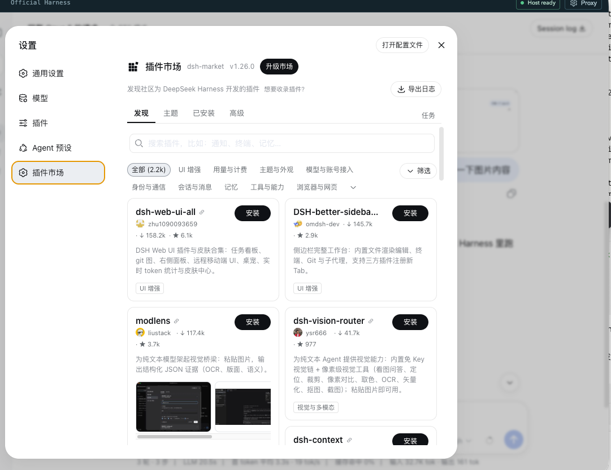
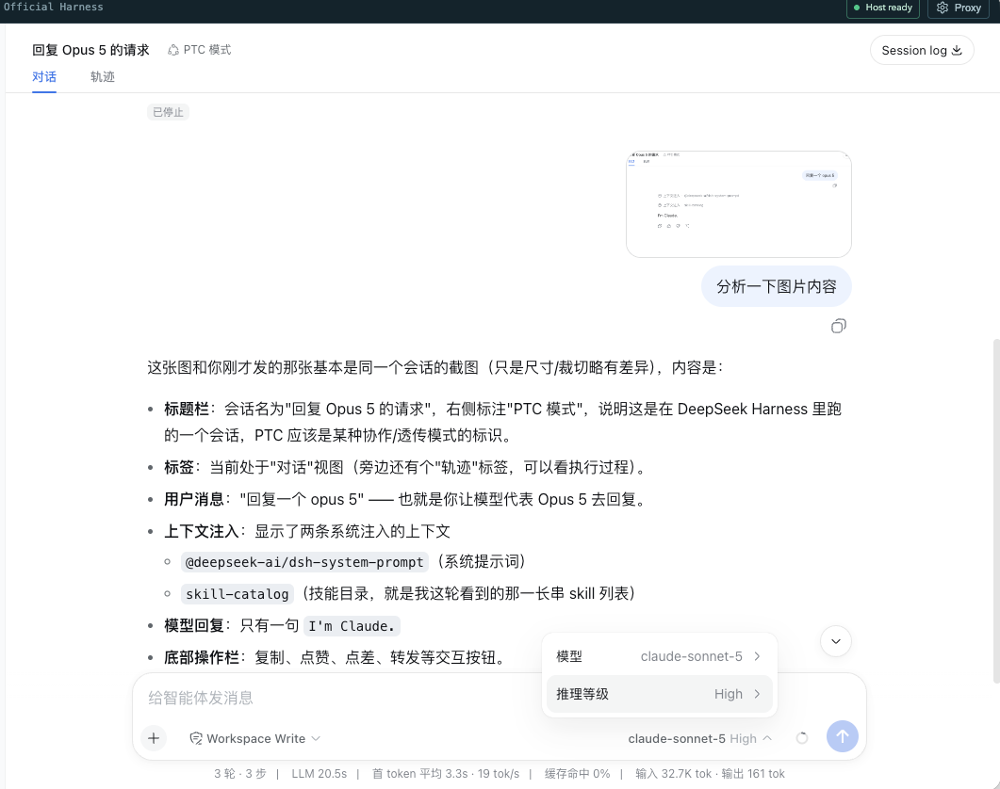

# DeepSeek Harness Desktop

[English](README.en.md) | 中文

`DeepSeek Harness Desktop` 是给 [DeepSeek Harness](https://github.com/deepseek-ai/deepseek-harness) 准备的 Electron 桌面工作台。将官方 Harness Web UI 嵌入原生桌面窗口，开箱即用。

## 快速开始

从 [Releases](https://github.com/tamakiramimy/deepseek-harness-electron/releases) 下载与你设备匹配的一个文件。每个文件都已内置对应架构的 Runtime，无需另外下载或复制 `DeepSeek-Harness-Dist`：

| 设备 | 安装包 / 便携版 |
| --- | --- |
| macOS Apple Silicon | `DeepSeek Harness Desktop-<version>-mac-arm64.dmg` |
| macOS Intel | `DeepSeek Harness Desktop-<version>-mac-x64.dmg` |
| Windows ARM64 | `...-win-arm64-setup.exe` 或 `...-win-arm64-portable.exe` |
| Windows x64 | `...-win-x64-setup.exe` 或 `...-win-x64-portable.exe` |

Windows `setup.exe` 使用向导安装，可选择安装目录；`portable.exe` 是免安装单文件，自解压后运行。首次启动会校验 Runtime 的 SHA-256 并将其展开到用户数据目录，后续直接复用。

## 主要特性

### 内置代理配置

支持在桌面工作台内直接配置 HTTP / HTTPS 代理，无需修改系统设置或环境变量。配置后会自动重启 Harness 运行时使其生效。


### 内置插件市场

社区插件市场 `dshmarket` 是可选组件。应用启动不依赖市场；需要时在外壳设置的 **Plugin market** 区域点击 **Install**，失败后可点击 **Retry**。

Runtime Dist 自带 pnpm，桌面端会在 `$DSH_HOME/.desktop-bin/` 写入 shim 并加进 Harness 子进程的 PATH。因此终端用户机器上无需安装 Node 或 pnpm —— `dsh plugin` 按裸名调用包管理器，缺失时会以退出码 127 失败。

市场安装需要访问 npm registry。安装失败不会中断 Harness；企业网络下建议先在右上角 **Proxy** 配好代理再重试。



### 多模态视觉模型支持

支持 `deepseek-v4-flash-vision-exp` 等视觉模型，可直接在对话中上传图片进行分析。

第三方 OpenAI Responses / Chat Completions / Anthropic provider 的模型能力可在 **模型 > 自定义设置 > 模型能力** 中逐模型配置。选择“文本 + 图片”会写入 `input: [text, image]`；选择思考等级会写入该模型的 `reasoningEfforts`，模型选择器随后会显示对应档位。

手工编辑 `settings.yaml` 时请注意：第三方 `llm-pi-ai` provider 使用模型级 `input` 和 `reasoningEfforts`，图片请求预算使用 provider 级 `requestImagePixelBudget` 与 `requestImageMaxBytes`。`inputModalities`、`imagePixelBudget`、`imageMaxBytes` 是 DeepSeek 官方适配器字段，放入第三方模型不会声明其视觉能力。

参考 JSON（也可按相同结构写入 YAML；请将示例地址、模型和环境变量改为你的实际值）：

```json
{
  "llm-pi-ai": {
    "providers": {
      "example": {
        "displayName": "Example API",
        "apiKeyEnv": "EXAMPLE_API_KEY",
        "api": "openai-responses",
        "baseURL": "https://api.example.com/v1",
        "requestImagePixelBudget": 640000,
        "requestImageMaxBytes": 1048576,
        "models": [
          {
            "id": "example-vision-model",
            "name": "Example Vision Model",
            "contextWindow": 1000000,
            "input": ["text", "image"],
            "reasoningEfforts": {
              "off": null,
              "low": "low",
              "medium": "medium",
              "high": "high",
              "xhigh": "xhigh"
            }
          }
        ]
      }
    }
  }
}
```

`api` 可使用 Runtime 支持的 `openai-responses`、`openai-completions` 或 `anthropic-messages`。`reasoningEfforts` 的值会原样传给对应 adapter；只配置上游实际支持的等级。OpenAI 兼容服务通常需要以 `/v1` 结尾的 `baseURL`，具体以服务商文档为准。API Key 应放在 `$DSH_HOME/.credentials.yaml` 或环境变量中，不要直接写入 README 或提交到 Git。




### 当前版本

| 组件 | 版本 |
| --- | --- |
| 桌面外壳 | v0.1.7 |
| DeepSeek Harness Runtime | `@deepseek-ai/dsh` v0.1.1-rc.2 |

## 更新日志

**v0.1.7**

- 安装包自带对应架构 Runtime，并在首次启动时校验、展开和复用
- Windows x64/ARM64 同时提供可选安装目录的安装版与 Portable 单 EXE
- `dshmarket` 改为可选的显式安装，失败不影响 Harness 启动
- Runtime 内置 pnpm，所有桌面端 `dsh` 调用固定使用受管 Runtime
- 修复 Windows 物理磁盘目录选择器提前断开 IPC 的问题
- 代理设置覆盖 Electron、Node、npm/pnpm 和 Git 常见环境变量

**v0.1.6**

- Runtime 内置 pnpm，首次启动自动安装 `dshmarket` 插件市场，并支持失败后延迟重试
- 第三方 `llm-pi-ai` 模型支持在设置界面配置视觉输入与思考等级
- Runtime 构建阶段自动修补并校验模型能力字段，重复执行保持幂等
- 补充 Release Runtime 的全局 `dsh`、插件安装及第三方模型 JSON 配置说明

**v0.1.5**

- 新增 Electron 桌面代理配置功能（HTTP / HTTPS / NO_PROXY），配置后自动重启 Harness
- 支持最新 `deepseek-v4-flash-vision-exp` 多模态视觉模型
- 升级内置 DeepSeek Harness Runtime 至 `@deepseek-ai/dsh` v0.1.1-rc.2
- 修复启动时额外弹出浏览器窗口的问题（增加 `--no-open` 参数）
- GitHub Actions 标签发布固定使用 `@deepseek-ai/dsh` v0.1.1-rc.2，并在 Runtime manifest 记录实际安装版本

## 本地开发

### 前置条件

- Node.js `>= 22.19.0`
- Corepack 和 pnpm（本项目使用 pnpm `11.15.1`）

```sh
node --version  # >= 22.19.0
corepack enable
pnpm --version
```

### 安装与运行

```sh
# 安装依赖
pnpm install

# 创建本地 Runtime Dist
pnpm harness:dist:install
pnpm harness:dist:validate

# 启动开发模式
pnpm dev
```

### 类型检查

```sh
pnpm typecheck
pnpm test
```

发行构建（Runtime 安装、归档和 electron-builder）只在 GitHub Actions 原生 runner 中执行，不在本地执行。

## CI / Release

GitHub Actions 工作流 [package.yml](.github/workflows/package.yml) 在四个原生 runner 上分别构建、裁剪并验证 Runtime，再将单架构压缩资产嵌入对应桌面包。macOS 输出两个 DMG；Windows x64/ARM64 各输出一个 assisted NSIS 安装包和一个 Portable 单 EXE。

- **手动触发**：在 Actions 页面选择 `Package Desktop Release`，可选指定 `harness_version`（默认 `0.1.1-rc.2`）
- **自动触发**：推送 `v*` 标签时自动构建并发布 Release

Runtime 构建时从 npm registry 拉取 `@deepseek-ai/dsh`，无需依赖 deepseek-harness 源码仓库。

## 常见问题

### 官方 Web UI 能打开但不能发送消息

在 **Settings → Models** 中检查是否已保存有效 API Key、provider 和模型。

### 提示 Runtime 校验或展开失败

重新下载与你系统架构匹配的发行文件。安装包内 Runtime 会执行目标架构、manifest 和 SHA-256 校验，不支持手工替换。

### 网络请求失败

点右上角 **Proxy** 按钮，填入 HTTP/HTTPS 代理地址（如 `http://127.0.0.1:7890`），点击 **Save & apply** 即可。

## 安全边界

- Renderer 启用 `contextIsolation` 和 `sandbox`，没有 Node integration
- Preload 仅暴露版本化、受限的桌面 API
- Official Harness 仅监听随机 `127.0.0.1` loopback 端口
- Runtime 包执行 SHA-256、目标架构和 CLI entry 边界校验
