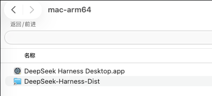
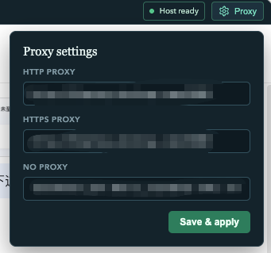
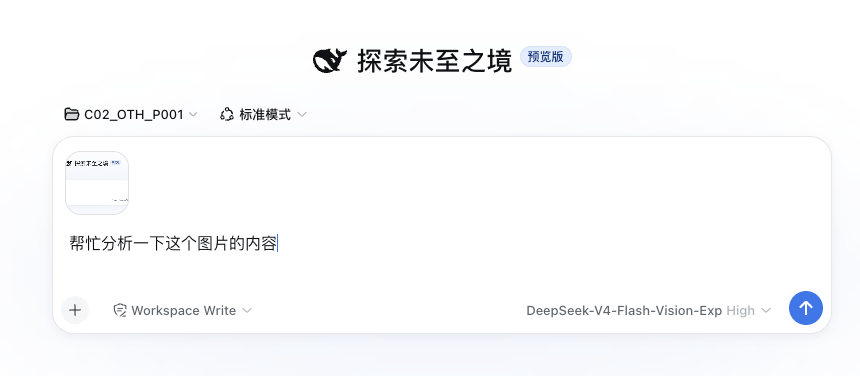
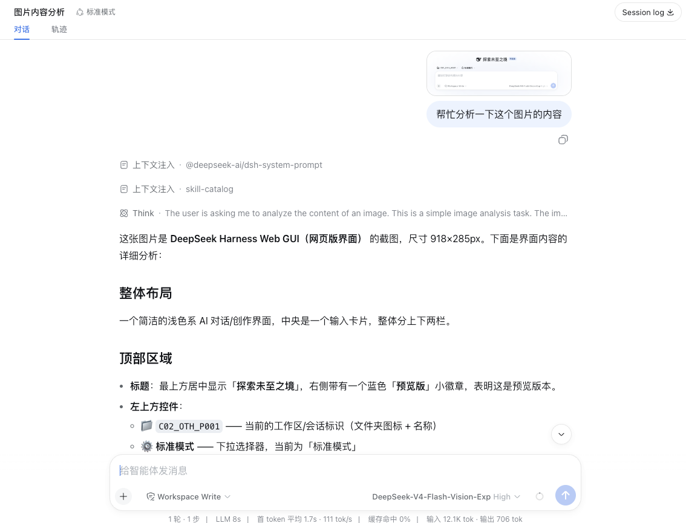

# DeepSeek Harness Desktop

[English](README.en.md) | 中文

`DeepSeek Harness Desktop` 是给 [DeepSeek Harness](https://github.com/deepseek-ai/deepseek-harness) 准备的 Electron 桌面工作台。将官方 Harness Web UI 嵌入原生桌面窗口，开箱即用。

## 快速开始

从 [Releases](https://github.com/tamakiramimy/deepseek-harness-electron/releases) 下载两个文件：

1. **Shell 安装包** — 根据你的设备选择：

| 设备 | 安装包 |
| --- | --- |
| macOS Apple Silicon | `DeepSeek.Harness.Desktop-<version>-darwin-arm64.dmg` |
| macOS Intel | `DeepSeek.Harness.Desktop-<version>-darwin-x64.dmg` |
| Windows ARM | `DeepSeek.Harness.Desktop-<version>-win32-arm64.exe` |
| Windows x64 | `DeepSeek.Harness.Desktop-<version>-win32-x64.exe` |

2. **Runtime Bundle** — 所有平台共用：

   `DeepSeek-Harness-Dist-<version>.zip`

将 Runtime Bundle 解压后，把 `DeepSeek-Harness-Dist` 文件夹放到应用文件旁边，启动应用即可：

```text
应用所在目录/
├── DeepSeek Harness Desktop.app   (或 .exe)
└── DeepSeek-Harness-Dist/
```



> Shell 会自动选择当前设备所需的 Runtime，无需额外设置。

## 主要特性

### 内置代理配置

支持在桌面工作台内直接配置 HTTP / HTTPS 代理，无需修改系统设置或环境变量。配置后会自动重启 Harness 运行时使其生效。



### 多模态视觉模型支持

支持 `deepseek-v4-flash-vision-exp` 等视觉模型，可直接在对话中上传图片进行分析。





### 当前版本

| 组件 | 版本 |
| --- | --- |
| 桌面外壳 | v0.1.5 |
| DeepSeek Harness Runtime | `@deepseek-ai/dsh` v0.1.1-rc.2 |

## 更新日志

**v0.1.5**

- 新增 Electron 桌面代理配置功能（HTTP / HTTPS / NO_PROXY），配置后自动重启 Harness
- 支持最新 `deepseek-v4-flash-vision-exp` 多模态视觉模型
- 升级内置 DeepSeek Harness Runtime 至 `@deepseek-ai/dsh` v0.1.1-rc.2
- 修复启动时额外弹出浏览器窗口的问题（增加 `--no-open` 参数）
- GitHub Actions 标签发布固定使用 `@deepseek-ai/dsh` v0.1.1-rc.2，并在 Runtime manifest 记录实际安装版本

## 本地开发

### 前置条件

- Node.js `>= 22.19.0`
- Corepack 和 pnpm（本项目使用 pnpm `11.15.1`）

```sh
node --version  # >= 22.19.0
corepack enable
pnpm --version
```

### 安装与运行

```sh
# 安装依赖
pnpm install

# 创建本地 Runtime Dist
pnpm harness:dist:install
pnpm harness:dist:validate

# 启动开发模式
pnpm dev
```

### 类型检查与构建

```sh
pnpm typecheck
pnpm build
pnpm test
```

### 打包

```sh
# macOS Apple Silicon
pnpm package:mac:arm64

# macOS Apple Silicon（带代理 — 适用于企业网络环境）
pnpm package:mac:arm64:proxy

# macOS Apple Silicon（带代理 + 自动软链 Runtime）
pnpm package:mac:arm64:proxy:runtime

# 其他平台
pnpm package:mac:x64
pnpm package:win:arm64
pnpm package:win:x64
```

## CI / Release

GitHub Actions 工作流 [package.yml](.github/workflows/package.yml) 自动构建四个平台的 Shell 安装包和 Runtime Bundle。

- **手动触发**：在 Actions 页面选择 `Package Desktop Release`，可选指定 `harness_version`（默认 `0.1.1-rc.2`）
- **自动触发**：推送 `v*` 标签时自动构建并发布 Release

Runtime 构建时从 npm registry 拉取 `@deepseek-ai/dsh`，无需依赖 deepseek-harness 源码仓库。

## 常见问题

### 官方 Web UI 能打开但不能发送消息

在 **Settings → Models** 中检查是否已保存有效 API Key、provider 和模型。

### 提示找不到 Runtime Dist

确保 `DeepSeek-Harness-Dist` 文件夹与 `.app` 放在同一目录下，且包含 `runtime-manifest.json`。

### 网络请求失败

点右上角 **Proxy** 按钮，填入 HTTP/HTTPS 代理地址（如 `http://127.0.0.1:7890`），点击 **Save & apply** 即可。

## 安全边界

- Renderer 启用 `contextIsolation` 和 `sandbox`，没有 Node integration
- Preload 仅暴露版本化、受限的桌面 API
- Official Harness 仅监听随机 `127.0.0.1` loopback 端口
- Runtime manifest 不允许 CLI entry 逃逸出 `DeepSeek-Harness-Dist/` 根目录